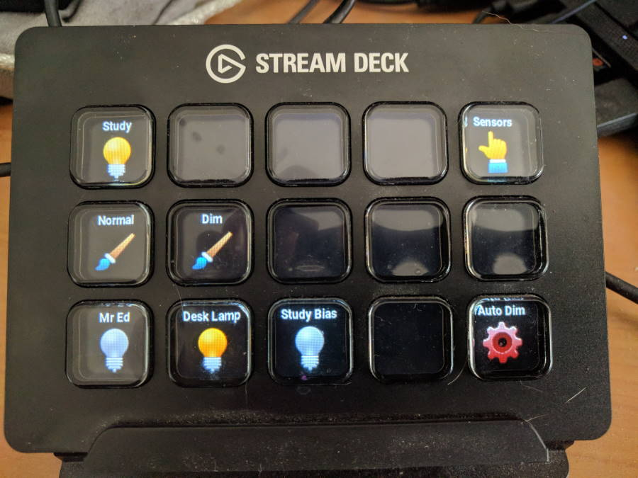

# Python Elgato HomeAssistant Client



This is an open source Python 3 application to control a
[Home Assistant](http://home-assistant.io) home automation instance remotely,
via an [Elgato Stream Deck](https://www.elgato.com/en/gaming/stream-deck). This
client is designed to be able to run run cross-platform, so that the StreamDeck
can be connected to both full PCs as well as stand-alone Raspberry Pis.

Unlike the official software client, which can be made to integrate with Home
Assistant via it's "Open Website" command macros, this client supports dynamic
updates of the button images to reflect the current entity states.

## Status:

Working. You can define your own page layout in the configuration YAML file, and
attach HomeAssistant lights and other entities to buttons on the StreamDeck. The
current state of the entity can be shown on the button in both text form, as
as image form (live button state updates are supported). The HomeAssistant
action to trigger when a button is pressed is also configurable.

This is my first asyncio project, and I'm not familiar with the technology, so
everything can be heavily improved. If you know asyncio, please submit patches
to help me out!

Nothing is robust yet, and the configuration format used in the `config.yaml`
file is not yet documented. Multiple pages are not yet supported.

## Dependencies:

### Python

Python 3.5 or newer is required. On Debian systems, this can usually be
installed via:
```
sudo apt install python3 python3-pip
```

### Python Libraries

This library uses my own [python-elgato-streamdeck](https://github.com/abcminiuser/python-elgato-streamdeck)
library to interface with the Stream Deck devices.

You will need to have the following additional libraries installed:

HIDAPI, for USB HID access:
```
pip3 install hidapi
```
Pillow, the Python Image Library (PIL) fork, for dynamic tile image creation:
```
pip3 install pillow
```
Asynchronous Websockets (AsyncWS), for communication with Home Assistant:
```
pip3 install asyncws
```
PyYAML, for configuration file parsing:
```
pip3 install pyyaml
```

## Raspberry Pi Installation:

The following script has been verified working on a Raspberry Pi (Model 2 B)
running a stock Debian Stretch image, to install all the required dependencies
needed by this project:

```
# Ensure system is up to date, upgrade all out of date packages
sudo apt update && sudo apt dist-upgrade -y

# Install the pip Python package manager
sudo apt install -y python3-pip

# Install system packages needed for the Python hidapi package
sudo apt install -y libudev-dev libusb-1.0-0-dev

# Install system packages needed for the Python pillow package
sudo apt install -y python-pil

# Install dependencies
pip3 install pillow
pip3 install asyncws
pip3 install pyyaml
pip3 install hidapi

# Install git and check out the repository
sudo apt install -y git
git clone https://github.com/abcminiuser/python-homeassistant-streamdeck.git
```

## License:

Released under the MIT license:

```
Permission to use, copy, modify, and distribute this software
and its documentation for any purpose is hereby granted without
fee, provided that the above copyright notice appear in all
copies and that both that the copyright notice and this
permission notice and warranty disclaimer appear in supporting
documentation, and that the name of the author not be used in
advertising or publicity pertaining to distribution of the
software without specific, written prior permission.

The author disclaims all warranties with regard to this
software, including all implied warranties of merchantability
and fitness.  In no event shall the author be liable for any
special, indirect or consequential damages or any damages
whatsoever resulting from loss of use, data or profits, whether
in an action of contract, negligence or other tortious action,
arising out of or in connection with the use or performance of
this software.
```
